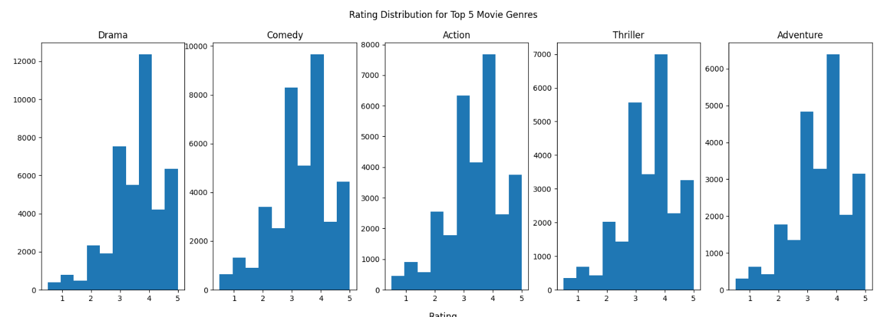

# Recommendation Systems Project

## Overview of Business Problem

The goal of this project is to provide a functioning recommendation system, as well as several actionable insights, for a startup movie streaming service. 

## Understanding the Data Source

The data comes from [MovieLens](https://grouplens.org/datasets/movielens/latest/), a dynamic dataset that contains 100,000 movie ratings generated by 600 users across 9,000 users.

## Data Limitations

Superusers were a significant limiting factor when it came to our initial data analysis because some of them accounted for a significant amount of reviews per user. See below:

Here we see that most users rated at most 250 movies, whereas a subset of superusers have rated anywhere between 1750 to 2750 movies per superuser.

## Data Analysis

Some general insights:

We find that a majority of movie ratings given in this dataset were to movies between the 1980s to the early 2000s.

Ratings for each of the top 5 movie genres are slightly skewed, revealing the median rating to be somewhere between 3.5 and 4 for every of the listed genres. 

However, some movies will be more popular than others, regardless of genre. Here we identify the top 20 most rated movies in the dataset.

## Modelling Process

The predictive model that serve as the basis of our recommendation system accounts for new users/soon-to-be existing and already-existing users as well. More specifically:

* To address the "cold start problem", we tested the Pearson Correlation Coefficient
* To address new users with minimal movie-rating information, we tested a KNNBasic model as well as an SVD model

## Conclusions and Future Insights

Based on MAE scores (regression metric) received from the aforementioned models, we commit to the SVD model as our final model. Further business recommendations are:
* Change UI to have movie recommendations near the top of the homepage.
* Include feedback survery icons to ultimately gain insight on the performance of the movie recommendations
* Include cast information to diversify future movie recommendations

Going forward, it is in our best interest to investigate the potential effects of using different devices to interact with the platform.

Please refer to the [Jupyter notebook](./index_final.ipynb) for additional EDAs and models.

If you have any questions, please contact our team:

Simon Hui (GitHub/Presentation Lead): simonh9963@gmail.com

Sangyun (Yun) Thom (Technical Lead): sangyun.thom@gmail.com

